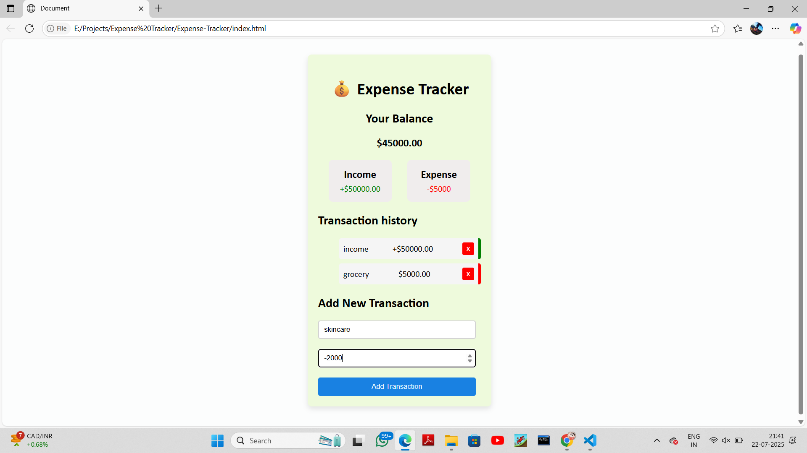

# 💰 Expense Tracker Web App

This is a simple and user-friendly **Expense Tracker** application built using **HTML**, **CSS**, and **JavaScript**. It allows users to manage their finances by adding income and expense transactions, and automatically calculates the total balance, income, and expenses.

## 🌐 Live Demo

👉 [Click here to view the hosted app](https://kowsalyal.github.io/expense-tracker/)  
*(Replace the link above with your actual GitHub Pages URL if it's different)*

## 🧩 Features

- Add income and expense transactions
- Dynamic transaction history
- Real-time balance, income, and expense summary
- Delete individual transactions
- Clean and responsive UI

## 🚀 Technologies Used

- HTML5
- CSS3
- JavaScript (Vanilla)

## 📸 Preview

## 📂 Project Structure

├── index.html # Main HTML structure
├── style.css # Styling for the app
└── index.js # JavaScript functionality

1. Clone the repository:
   git clone https://github.com/kowsalyal/expense-tracker.git

2. Open index.html in any modern browser.

3. Start tracking your expenses!
